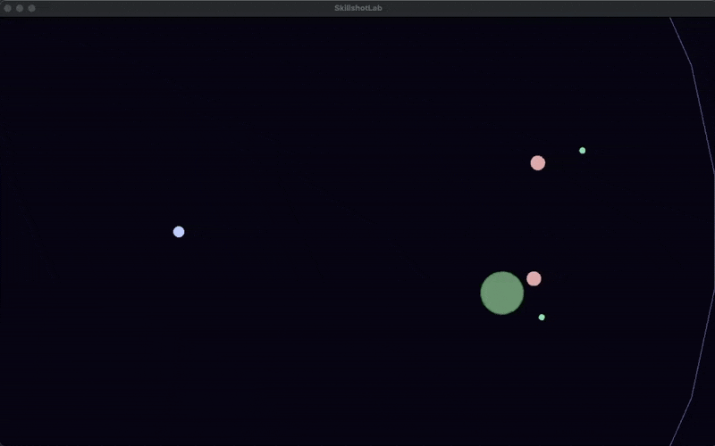

# SkillshotLab

small C++ playground for skillshot prediction and evasion

The simulation is a top down arena that shows:

* A caster that auto aims and fires projectiles
* An endless horde of enemy targets that bounce around the map
* Enemy shots fired back at the caster
* A simple evade system that tries to sidestep incoming skillshots
* Visual feedback for prediction error, explosions and hits
* Live stats for accuracy and damage taken

Everything runs in a single executable and uses only standard C++ and SFML.

---

## Concept

I want to represent some concepts:

* Representing movement and abilities with clean geometry
* Predicting future positions under simple motion models
* Choosing cast positions that balance hit chance and range
* Reasoning about incoming projectiles and safe movement


The caster sits on the left side of the arena.  
Enemies move inside a world box and the system:

1. Predicts where each enemy will be after cast delay and projectile travel time  
2. Fires projectiles toward those predicted impact points  
3. Clamps casts to ability range when needed  
4. Tracks shots fired, hits and prediction positions at the moment of impact

At the same time enemies fire their own projectiles at the caster.  
A simple evade routine looks at those enemy shots and moves the caster roughly perpendicular to the most dangerous trajectory.

The result is a loop of

* Aim  
* Fire  
* Dodge  
* Measure

---

## Visual elements

What you see in the window:

* Pale blue circle on the left  
  Caster position

* Red or pink circles  
  Enemy targets

* Small yellow circles  
  Friendly projectiles fired by the caster

* Small blue circles  
  Enemy projectiles fired at the caster

* Green ring around the caster  
  Ability range

* Green explosions on hit  
  Enemy popped by a friendly projectile, then immediately respawned elsewhere

* Faint ghost and line on each explosion  
  Ghost marker shows where the predictor thought the enemy would be  
  Line connects predicted point to actual hit position which visualizes prediction error

The caster flashes red when hit by an enemy projectile.

A text HUD at the top left shows:

* Shots fired  
* Hits landed  
* Accuracy percentage  
* Damage taken so far

---

## Build instructions

Dependencies:

* C++17 compatible compiler  
* CMake 3.16 or newer  
* SFML 3

On macOS with Homebrew:

```bash
brew install cmake sfml
```


# SkillshotLab

SkillshotLab is a small C++ playground for experimenting with skillshot prediction, geometry, and decision logic without depending on any game API.

This version includes a simple graphical view using SFML. It shows:

* The caster as a circle at the center left
* Moving targets as circles
* Predicted impact points and lines from the caster toward them

## Requirements

* A C++17 capable compiler
* CMake
* SFML 2.5 or newer

On macOS with Homebrew:

```bash
brew install sfml
```

## Building

```bash
mkdir build
cd build
cmake ..
cmake --build .
./SkillshotLab
```

You should see a window with moving targets and predicted hit points updating in real time.
